

# Matériel complémentaire pour SAGEO 2019 
Annexes de l'article *Estimer l'apport de la phénologie dans la classification des essences forestières* par Nicolas Karasiak, Jean-François Dejoux, Claude Monteil and David Sheeren.

 
 
  {{ content }} 

## Carte interactive des essences cartographiées en 2018

La cartographie des essences forestières de 2018 présentée en aperçu ci-dessous a été générée à partir des 44 meilleures bandes de la série temporelle Sentinel-2 de 2018. Cliquez sur l'image pour accéder à la version interactive :

<a href='map/index.html'>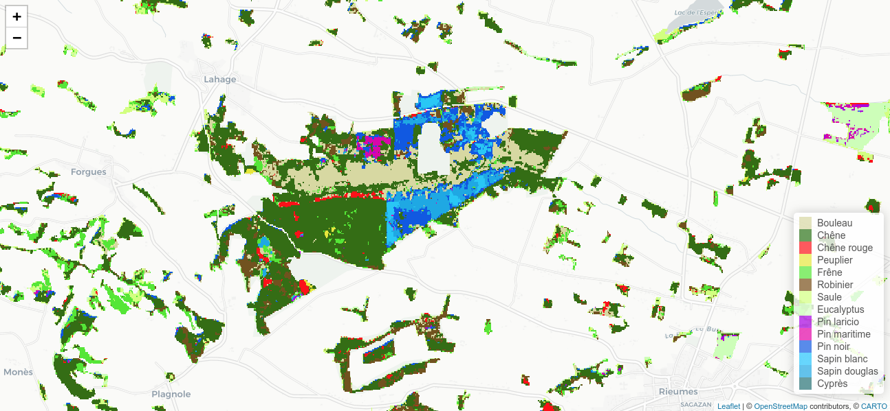</a>

## Comportement spectral moyen des feuillus en 2018 

<table>
  <tr>
    <td>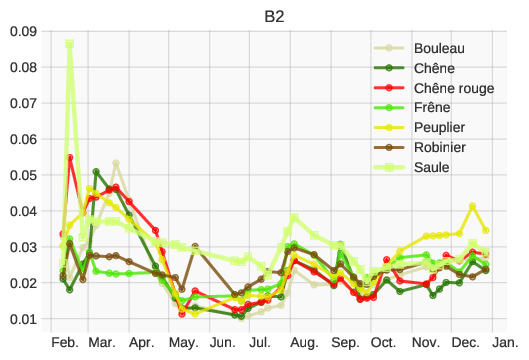</td>
    <td>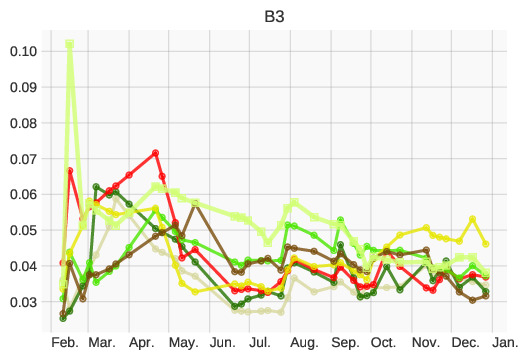</td>
  </tr>
  <tr>
    <td>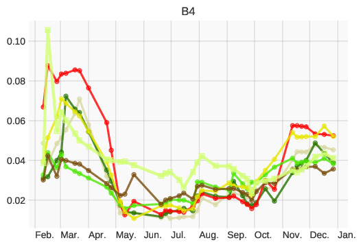</td>
    <td>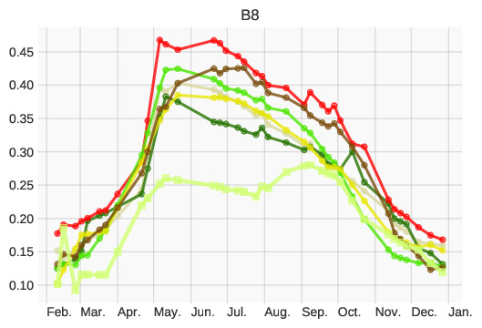</td>
  </tr>
  <tr>
    <td>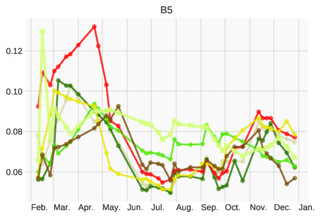</td>
    <td>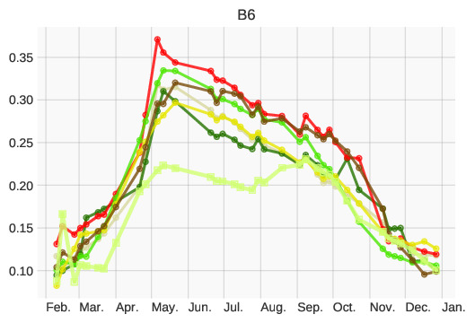</td>
  </tr>
  <tr>
    <td>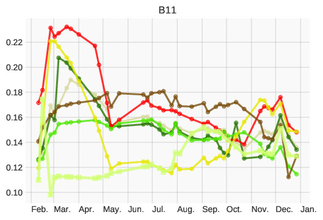</td>
    <td>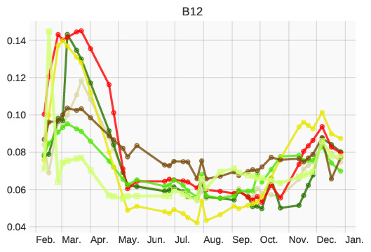</td>
  </tr>
 </table>
  
## Dates sélectionnées

### Classification 1 feuillus contre l'ensemble des feuillus
Classification à 2 classes.
<table>
  <tr>
    <th>2017</th>
    <th>2018</th>
  </tr>
  <tr>
    <td>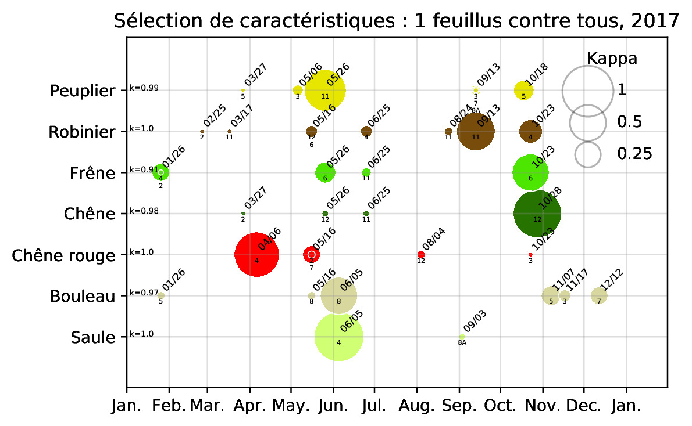</td>
    <td>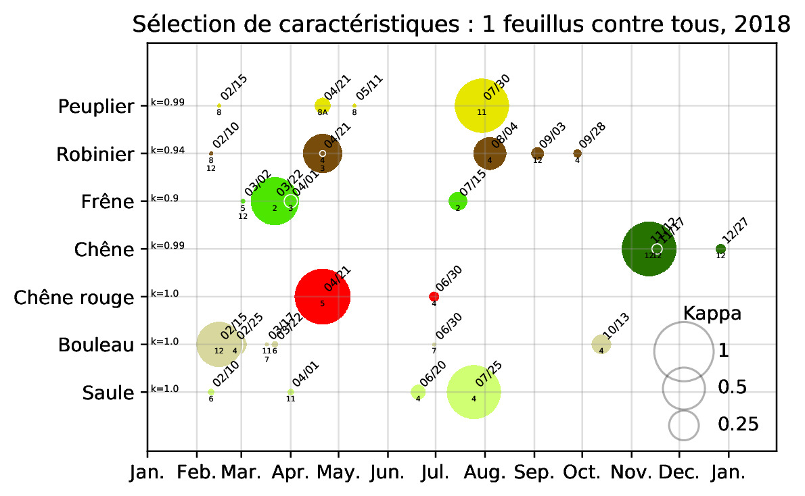</td>
  </tr>
</table>

### Classification des 7 feuillus simultanément
Classification à 7 classes.
<table>
  <tr>
    <th>2017</th>
    <th>2018</th>
  </tr>
  <tr>
    <td>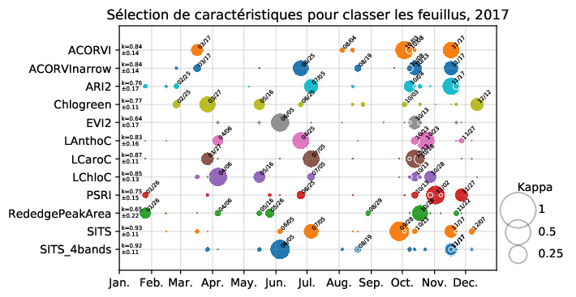</td>
    <td>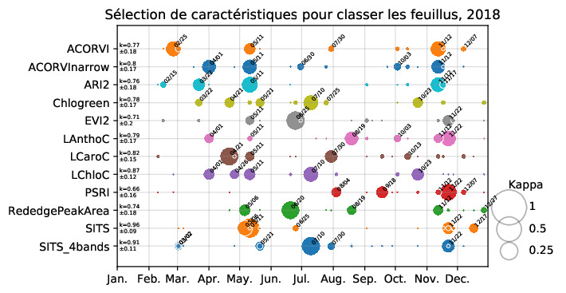</td>
  </tr>
</table>

## Stabilité de la cartographie

### Stabilité des feuillus 
Évolution de la part des feuillus prédits dans la cartographie globale réalisée avec la meilleure sélection de caractéristiques en 2017 et 2018.

<table>
  <tr>
    <th>2017</th>
    <th>2018</th>
  </tr>
  <tr>
    <td>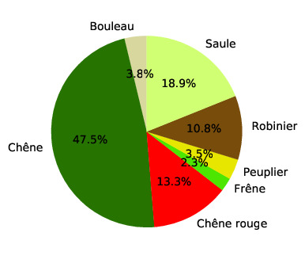</td>
    <td>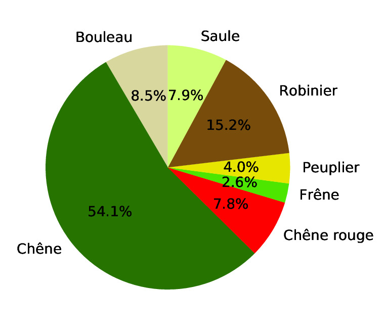</td>
  </tr>
</table>

### Stabilité de l'ensemble des essences

Évolution de la part par essence dans la cartographie de 2017 et 2018.
Avec ou sans SFS (Sélection de Caractéristiques, en anglais Sequential Forward Selection).

<table>
  <tr>
    <th>Sans SFS</th>
    <th>Avec SFS</th>
  </tr>
  <tr>
    <td>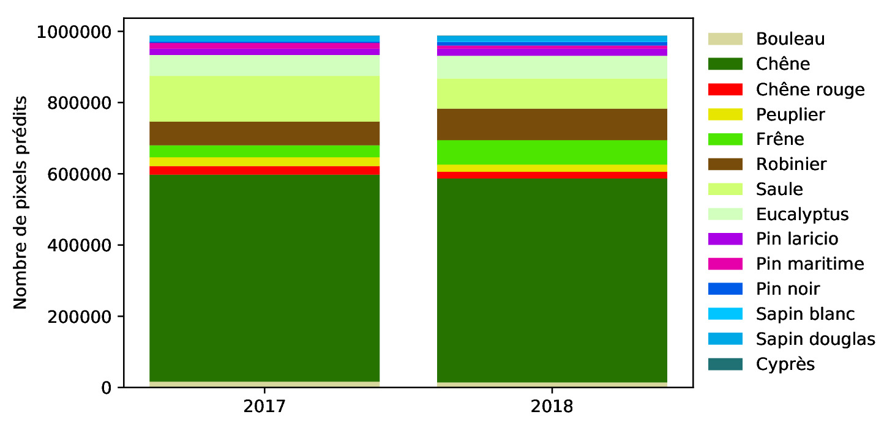</td>
    <td>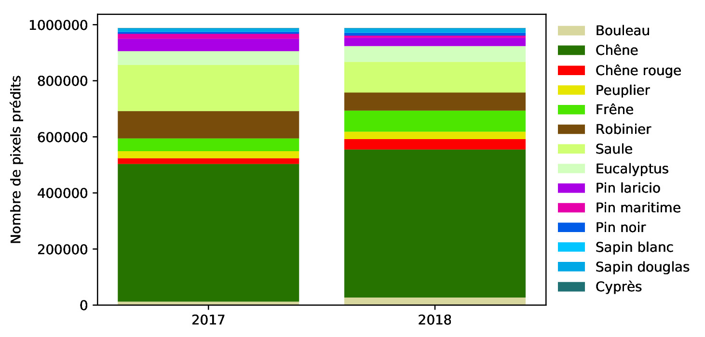</td>
  </tr>
</table>

