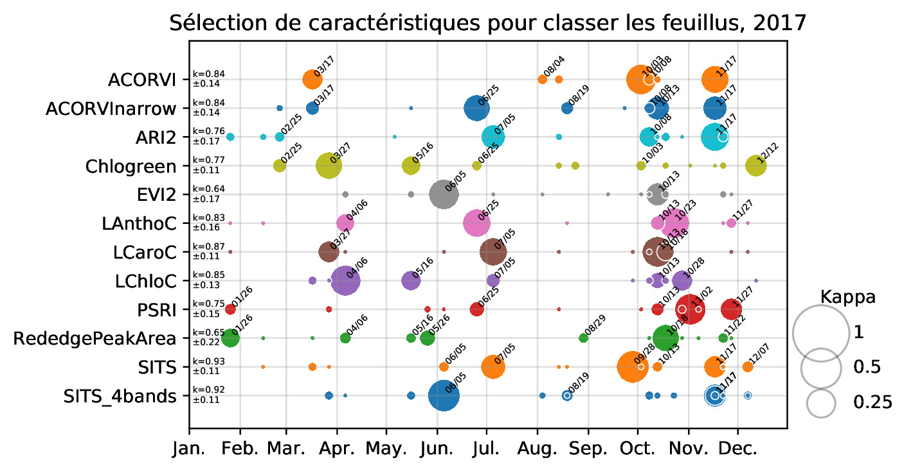
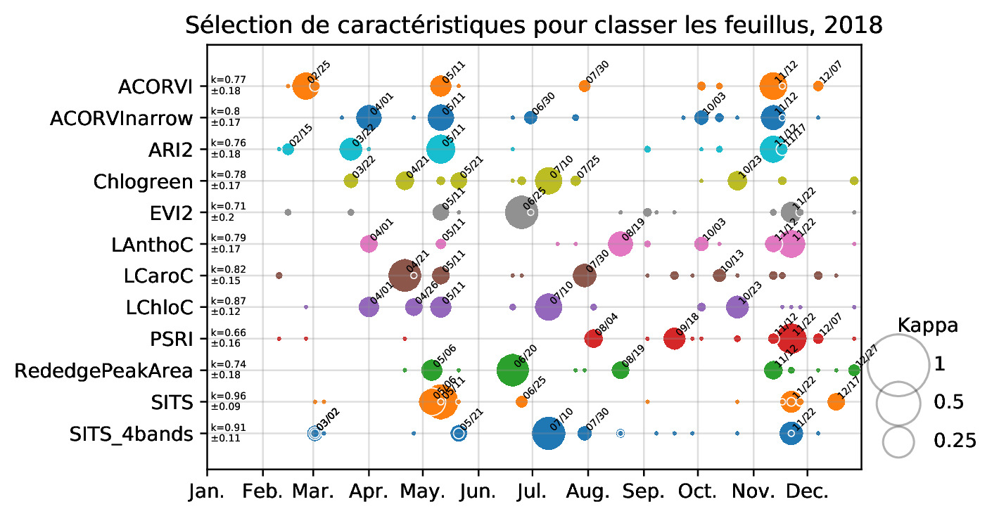

# Matériel complémentaire pour SAGEO 2019 
Annexes de l'article *Estimer l'apport de la phénologie dans la classification des essences forestières* par Nicolas Karasiak, Jean-François Dejoux, Claude Monteil and David Sheeren.
## Carte intéractive des essences cartographiées en 2018

[Embed map here]

## Comportement spectral des feuillus en 2018 
<table>
  <tr>
    <td></td>
    <td></td>
  </tr>
  <tr>
    <td></td>
    <td></td>
  </tr>
  <tr>
    <td></td>
    <td></td>
  </tr>
  <tr>
    <td></td>
    <td></td>
  </tr>
 </table>
  
## Dates sélectionnées

### Classification 1 feuillus contre l'ensemble des feuillus
Classification à deux classes.
<table>
  <tr>
    <th>2017</th>
    <th>2018</th>
  </tr>
  <tr>
    <td></td>
    <td></td>
  </tr>
</table>

### Classification des 7 feuillus simultanément
Classification à 7 classes.
<table>
  <tr>
    <th>2017</th>
    <th>2018</th>
  </tr>
  <tr>
    <td></td>
    <td></td>
  </tr>
</table>

### 
## Stabilité de la cartographie

Évolution de la part des feuillus prédite dans la cartographie globale en 2017 et 2018.

<table>
  <tr>
    <th>2017</th>
    <th>2018</th>
  </tr>
  <tr>
    <td></td>
    <td></td>
  </tr>
</table>

